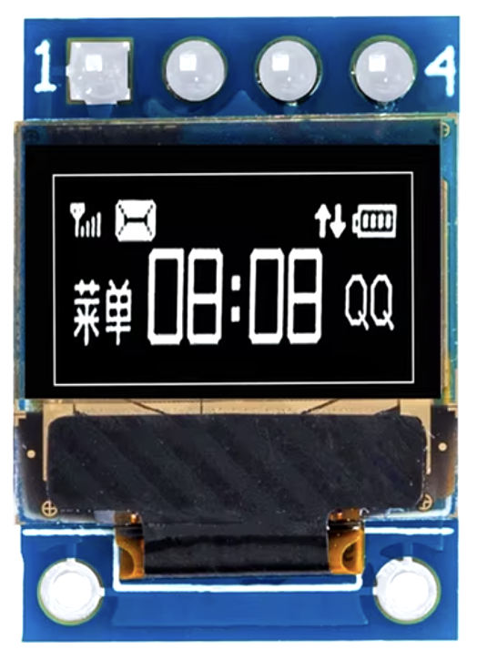
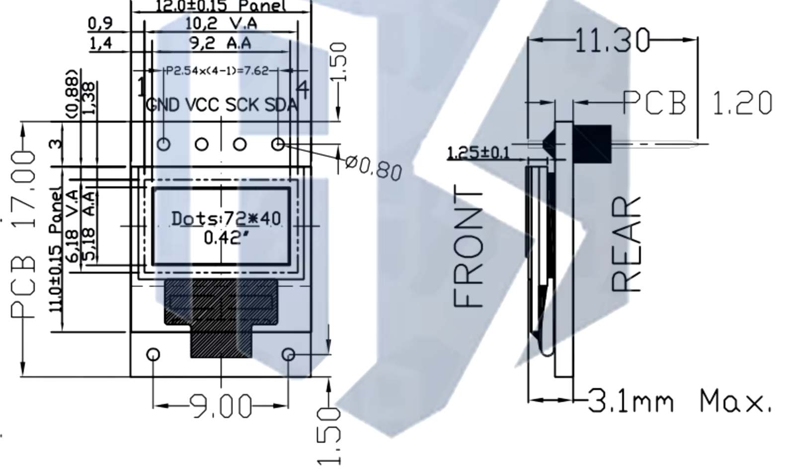

# Hagiwo Unison VCO

> [!NOTE]
> This is a work in progress, I'm sure I made a mistake somewhere I'll post an update when I receive the first batch of boards. 

If you don't know Hagiwo, check out their [YouTube channel](https://www.youtube.com/@HAGIWO). He puts out new DIY Eurorack module designs all the time.

This is (what is currently) has latest module, the [Unison VCO](https://note.com/solder_state/n/na0ae5754fa9c). All I've done is switch to SMT devices to try to fit it all on a single 6hp PCB. All credit for the circuit design go to Hagiwo.

The PCB is 100x30mm so it should be pretty darned cheap to order from one of the fabs over in China. Higawo used a [Seeed Studio XIAO RA4M1](https://wiki.seeedstudio.com/getting_started_xiao_ra4m1/) microcontroller module on this one, which are about $5 ordered from Seeed. They're really quite neat.

I added a tiny OLED display module to show the currently selected waveform. The display module is available from all the usual places with with search terms like "0.42" 0.42 Inch White OLED Display LCD Module 72X40 Serial Screen White Color I2C IIC/SPI Interface SSD1306". I'm sure there's an original manufacturer of these things but I can't figure it out. The 4 pin I2C SSD1306 version that looks like this:

